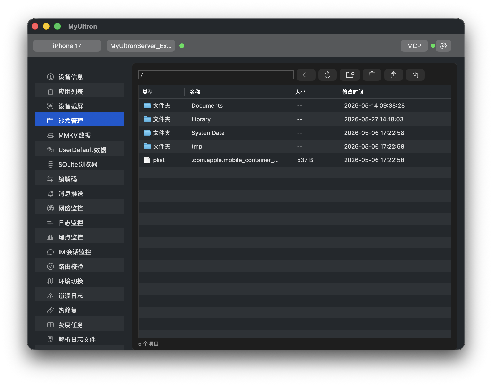

# MyUltron

[English](./README.md) | [中文](./README-zh.md) 



iOS 调试工具桌面客户端。通过 USB 或模拟器连接到 iOS 应用中嵌入的 MyUltronServer，提供设备信息、沙盒管理、日志监控、数据库浏览等调试功能。

## 设备连接

- **真机** — USB 连接，通过 libimobiledevice + usbmuxd 端口转发
- **模拟器** — localhost TCP 连接，端口可通过 Preferences 配置（默认 62345）
- 自动发现已启动的模拟器和 USB 连接的真机
- 支持拖拽 `.app` / `.ipa` 安装到已连接设备

## 功能列表

| 功能 | 说明 | 状态 |
|---|---|---|
| 设备信息 | 显示设备基本信息（设备名、系统版本、UDID 等） | ✅ |
| 应用列表 | 已安装用户应用列表（名称、Bundle ID、版本） | ✅ |
| 设备截屏 | 实时获取 iOS 设备屏幕截图 | ✅ |
| 沙盒管理 | 浏览、创建、删除、上传、下载沙盒文件 | ✅ |
| MMKV数据 | 浏览和管理 MMKV 键值存储数据 | 🚧 |
| UserDefault数据 | 浏览和管理 NSUserDefaults 数据 | ✅ |
| SQLite浏览器 | 选择数据库、浏览表数据、增删改查 | ✅ |
| 编解码 | Base64 / URL encode-decode 等常用编码工具 | ✅ |
| 消息推送 | 向已连接应用发送自定义推送消息 | ✅ |
| 网络监控 | 实时监控应用网络请求，支持 Mock 数据 | ✅ |
| 日志监控 | 实时查看应用控制台日志 | ✅ |
| 埋点监控 | 监控应用埋点事件 | 🚧 |
| IM会话监控 | 监控 IM 会话消息 | 🚧 |
| 路由校验 | 验证应用路由配置 | 🚧 |
| 环境切换 | 切换应用运行环境（开发/测试/生产） | 🚧 |
| 崩溃日志 | 查看和导出应用崩溃日志 | 🚧 |
| 热修复 | 管理应用热修复补丁 | 🚧 |
| 灰度任务 | 管理灰度发布任务 | 🚧 |
| 解析日志文件 | 解析 xlog/mars 加密日志文件 | 🚧 |

## 侧边栏自定义

功能模块可显示/隐藏，设置通过 NSUserDefaults 持久化。

## MCP（模型上下文协议）

MyUltron 可将调试工具暴露为 MCP 服务器，让 **Claude Code** 等 AI 助手直接与 iOS 设备交互——截屏、读取沙盒文件、查询数据库等。

### 启用 MCP

1. 在 MyUltron App 中连接设备并选择 App（TCP 状态灯变绿）
2. 点击工具栏 **MCP** 按钮 — 启动成功后右侧出现绿色圆点，服务运行在 `localhost:9021`

### 在 Claude Code 中连接

```bash
claude mcp add --scope project myultron nc localhost 9021
```

这会在项目根目录生成 `.mcp.json` 配置文件，可随 git 提交。

### 可用 MCP 工具

| 工具 | 说明 | 需要 App |
|------|------|:---:|
| `list_devices` | 列出已连接的 iOS 设备和模拟器 | 否 |
| `device_info` | 获取设备详细信息 | 否 |
| `list_apps` | 列出设备上已安装的应用 | 否 |
| `take_screenshot` | 截屏并保存到 `~/Desktop/` | 是 |
| `list_sandbox_dir` | 列出沙盒目录内容 | 是 |
| `read_sandbox_file` | 读取沙盒中的文件 | 是 |
| `delete_sandbox_file` | 删除沙盒中的文件或目录 | 是 |
| `list_user_defaults` | 列出所有 NSUserDefaults 键 | 是 |
| `get_user_default` | 获取指定 UserDefaults 值 | 是 |
| `set_user_default` | 设置 UserDefaults 值 | 是 |
| `delete_user_default` | 删除 UserDefaults 键 | 是 |
| `list_sqlite_dbs` | 列出沙盒中的 SQLite 数据库 | 是 |
| `list_sqlite_tables` | 列出数据库中的表 | 是 |
| `query_sqlite` | 查询表中的数据 | 是 |
| `send_push` | 发送模拟推送通知 | 是 |
| `list_network_requests` | 列出捕获的网络请求 | 是 |
| `url_encode` | URL 编码字符串 | 否 |
| `url_decode` | URL 解码字符串 | 否 |
| `base64_encode` | Base64 编码字符串 | 否 |
| `base64_decode` | Base64 解码字符串 | 否 |
| `md5_hash` | 计算字符串的 MD5 哈希 | 否 |

## 系统要求

- macOS 13+
- Xcode 14+
- libimobiledevice（用于真机通信）
